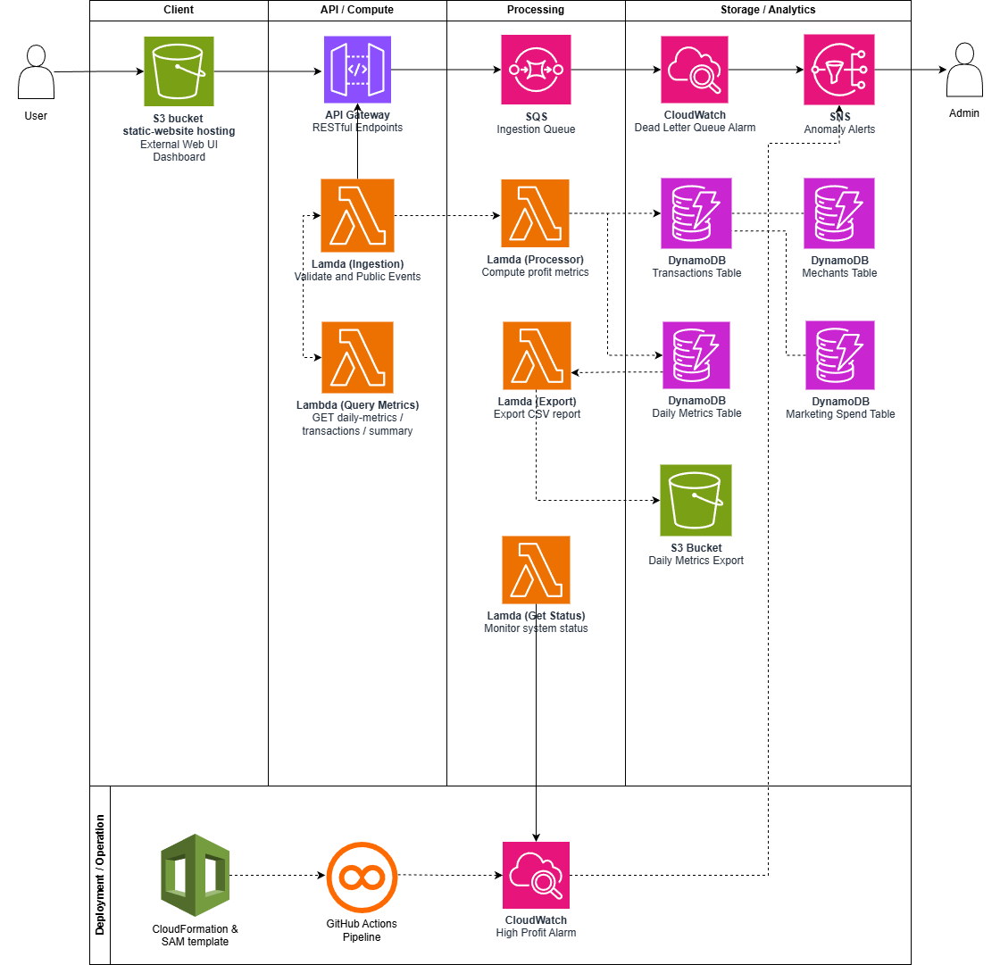

# AWS SAM Teamplate:
## 1. High-Level Architecture:
TrueProfit MVP is a fully serverless application with event-driven desinged to provide merchants with profit analytics.



### Architecture Overview:
- **Client Tier:** A static website dashboard hosted on S3 using HTML5, CSS3, and JavaScript.

- **API / Compute Tier:** Amazon API Gateway exposes RESTful endpoints, while AWS Lambda handles request validation and status checks.

- **Processing Tier:** Amazon SQS buffers incoming transactions, which are then processed asynchronously by processing Lambda functions.

- **Storage & Analytics Tier:** Data is persisted in DynamoDB and exported to S3 for CSV reporting.

- **Deployment & Operation:** Infrastructure is managed via AWS SAM, with observability provided by CloudWatch and automated alerts sent via SNS.

## 2. Prerequisites:
* [AWS CLI](https://aws.amazon.com/cli/): The primary language for backend logic
* [AWS SAM CLI](https://docs.aws.amazon.com/serverless-application-model/latest/developerguide/serverless-sam-cli-install.html): Managing infrastructure as code
* [Docker](https://www.docker.com/get-started/): Required for local builds and containerized function packaging
* [GitHub Runner Agent](https://www.docker.com/get-started/): A self-hosted runner on Cloud9 environment for CI/CD pipeline in the AWS Learner Lab

```bash
# Verify installed packages:
aws --version
sam --version
docker --version
```

## 3. Initialize and Build:
Prepare your deployment artifacts and install dependencies:
```bash
# Validate the template syntax:
sam validate

# Build the SAM application:
sam build

# Deploy for the first time:
sam deploy --guided \
--stack-name true-profit-mvp \
--region us-east-1 \
--capabilities CAPABILITY_IAM \
--confirm-changeset
```
After a successful build and deployment, the SAM CLI will output an API Endpoint. Invoke transaction function for verification:
```bash
Invoke-RestMethod -Method Post \
-Uri "<IngestionQueueUrl>" \
-ContentType "application/json" \
-Body '{"merchant_id":"M123","revenue":150.00,"ad_spend":10.00,"fees":2.50,"cost":90.00}'
```

Copy the API Gateway endpoint URL and paste to TrueProfit dashboard website to sync the frontend with cloud backend.

## 4. CI/CD Pipeline:
The GitHub Actions have two stages:

- **Testing:** The pipeline install required dependecies and run through all unit tests for backend logic. Then validate the SAM template before passing down to deployment stage.

- **Deployment:** Triggered after test stage succeed. The application is run on a self-hosted Linux runner within Cloud9 environment. The deployment process build application to package latest code and run deploy using samconfig.toml to update CloudFormation stack.